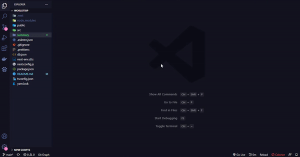

# Learning JavaScript

Projeto com foco nos estudos

✓ Working With Javascript!  
✓ Working With TypeScript!  
✓ Working With React!  
✓ Working With NextJs!  
✓ Working With React-Hooks!  
✓ Working With MirageJs!  

 <h1>✅Project</h1>
 <h3>📚 Funcionamento</h3>

<h6 align="center">
  
</h6>
<h2></h2>

<h3>📚 Código</h3>
<h6 align="center">
  
</h6>
<h2></h2>

<h3>Link para o site</h3>

<a href="https://worldtrip-pearl.vercel.app/" target="_blank" >https://worldtrip-pearl.vercel.app/</a>

